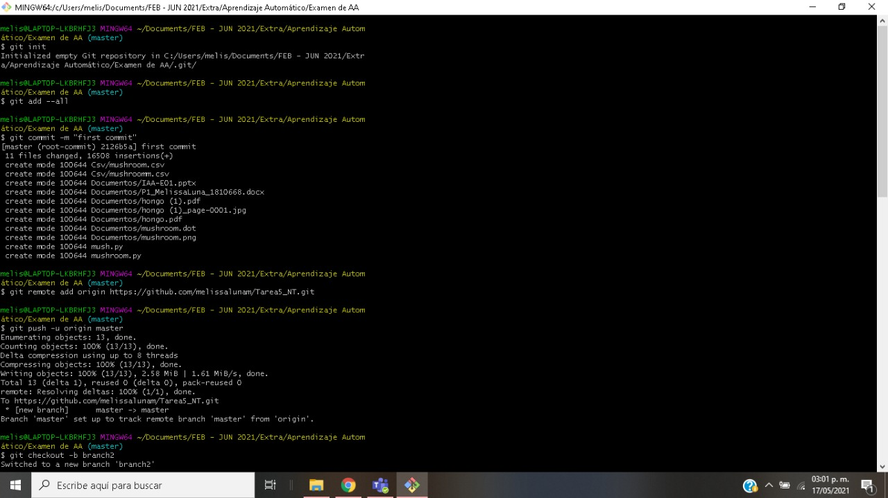
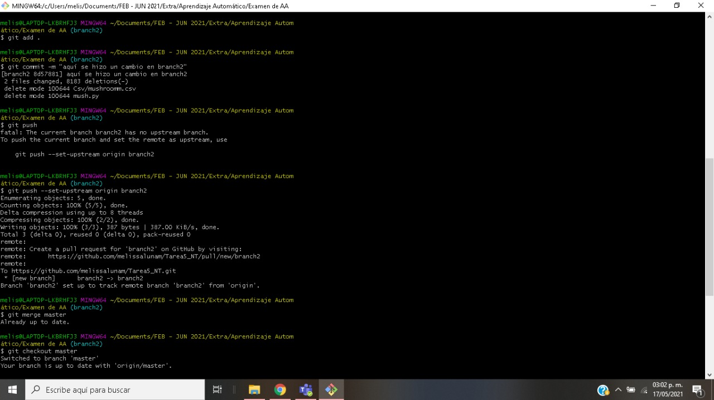
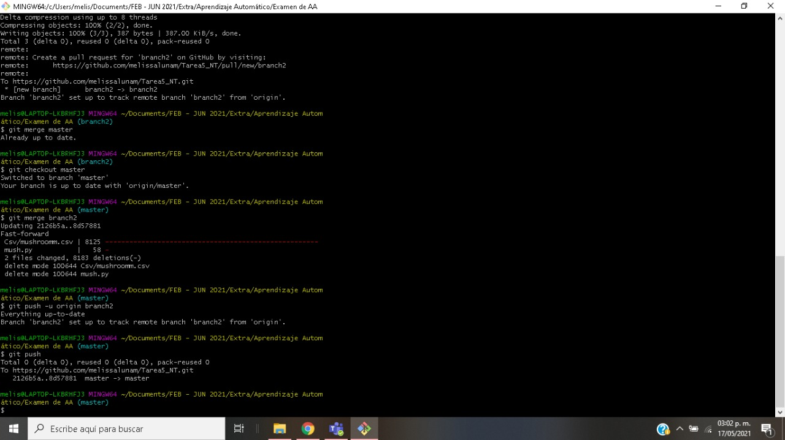

# Tarea5_NT
Tarea 5 de Nuevas Tecnologías

Primero se creó el repositorio.  
Después se seleccionó la carpeta con los documentos a subir al repositorio y se abrió en Git Bash.  

 Aquí se pueden ver los primeros comandos que se ingresaron para pasar todo el proyecto al repositorio. </img>

Comandos: 
>> git init  
>> git add --all  
>> git commit -m "first commtit"  
>> git remote add origin https://github.com/melissalunam/Tarea5_NT.git  
>> git push -u origin master

Luego, se creó el segundo branch con el siguiente comando:  
>> git checkout -b branch2

</img>

Se hizo cambios en la carpeta del proyecto y se subió en el segundo branch con los siguientes comandos:  
>> git add .  
>> git commit -m "aquí se hizo un cambio en branch2"  
>> git push --set-upstream origin branch2  

Después de esto, ya se veía reflejado el cambio en el repositorio.  
Para hacer un merge, primero se cambió de branch (de branch2 a master) con el siguiente comando:  
>> git checkout master  

</img>

Para el merge, se utilizó el siguiente comando:  
>> git merge branch2  

Y, por último, para que se viera reflejado en el repositorio se hizo un push:  
>> git push
